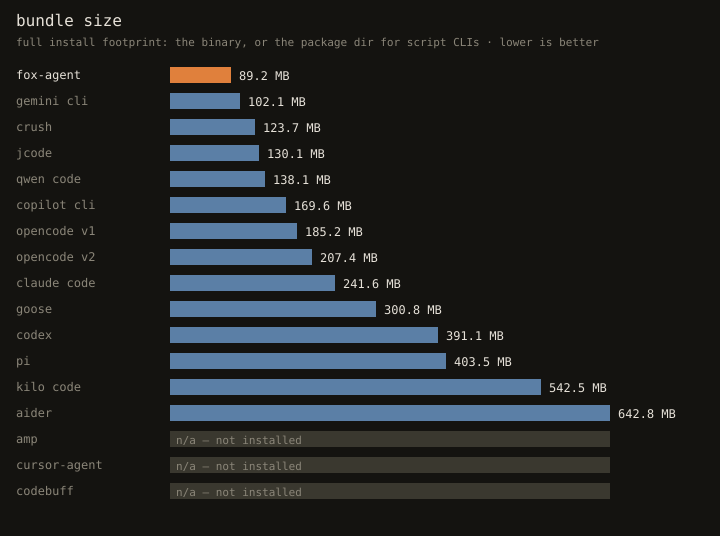
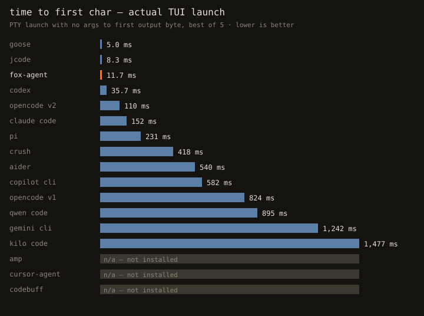
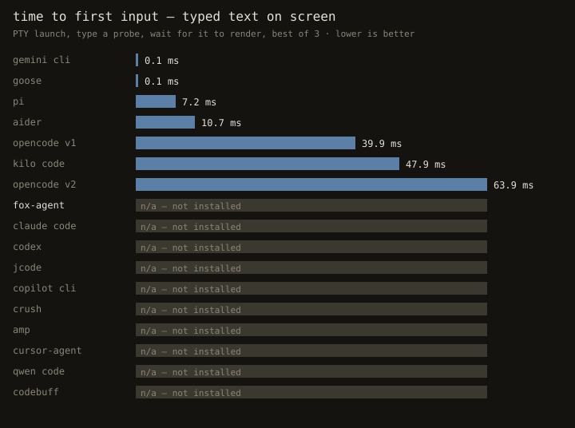
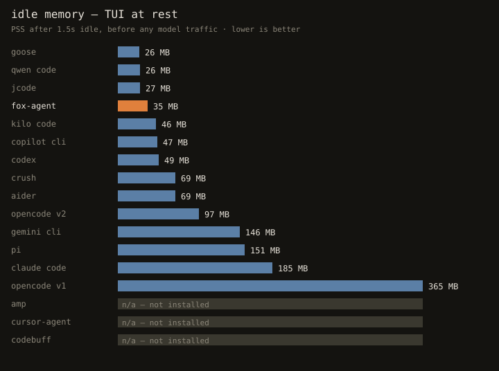

# fox-agent

[](https://github.com/QQSHI13/fox-agent/actions/workflows/ci.yml)
[](https://github.com/QQSHI13/fox-agent/actions/workflows/bench.yml)
[](https://github.com/QQSHI13/fox-agent/releases)
[](LICENSE)
[](https://bun.sh)

A light coding harness with **agent-controlled context** -- the agent edits its own context window natively (`ctx_edit`), no host hacks.

Full machine control, zero permission prompts. Production turn loop with step caps, retry/backoff, parallel tool execution, abort-safe partial persistence, and auto-compaction near the context limit. SQLite event-sourced sessions. OpenAI-compatible gateway first plus native Anthropic and Google providers. TUI and headless modes. ACP both ways. Plugin system.

---

## Performance

<!-- bench:start -->





| agent | version | bundle | `--version` | TUI 1st byte | TUI 1st input | idle PSS |
|---|---|---|---|---|---|---|
| **fox-agent** | 0.5.0-beta.1 | 89.2 MB | 10 ms | **12 ms** | — | 33 MB |
| claude code | 2.1.281 (Claude Code) | 237.4 MB | 7 ms | **150 ms** | — | 174 MB |
| codex | codex-cli 0.156.1 | 386.9 MB (pkg) | 35 ms | **37 ms** | — | 49 MB |
| opencode v1 | 1.18.32 | 185.2 MB | 465 ms | **789 ms** | **32 ms** | 358 MB |
| opencode v2 | opencode2 v0.0.0-beta-19271 | 207.4 MB | 67 ms | **110 ms** | **49 ms** | 125 MB |
| jcode | jcode v0.88.0 (ee4cd3db3) | 130.1 MB | 8 ms | **10 ms** | — | 23 MB |
| pi | 0.87.1 | 403.5 MB (pkg) | 179 ms | **222 ms** | **6 ms** | 143 MB |
| gemini cli | 0.61.0 | 102.1 MB (pkg) | 1123 ms | **1187 ms** | **0 ms** | — |
| copilot cli | GitHub Copilot CLI 1.0.88. | 169.6 MB (pkg) | 461 ms | **543 ms** | — | 47 MB |
| crush | crush version v0.96.1 | 123.7 MB (pkg) | 118 ms | **502 ms** | — | 69 MB |
| goose | 1.52.0 | 300.8 MB | 6 ms | **6 ms** | **0 ms** | — |
| aider | aider 0.86.2 | 642.8 MB (pkg) | 621 ms | **547 ms** | **8 ms** | 67 MB |
| amp | n/a (not installed) | — | — | — | — | — |
| cursor-agent | n/a (not installed) | — | — | — | — | — |
| qwen code | 0.24.4 | 154.6 MB (pkg) | 33 ms | **1269 ms** | — | 26 MB |
| codebuff | n/a (not installed) | — | — | — | — | — |
| kilo code | 7.7.9 | 542.5 MB (pkg) | 859 ms | **1524 ms** | **39 ms** | 46 MB |

fox-agent headless vs scripted local provider: time to first token **58 ms**, peak RSS **59 MB**.

_Generated 2026-09-24T11:47:27Z on Linux x86_64 (6.17.0-1022-azure). [How this is measured](#benchmarks) · [raw JSON](bench/results.json)_
<!-- bench:end -->

---

## Table of Contents

- [Performance](#performance)
- [Quick Start](#quick-start)
- [Install](#install)
- [Run](#run)
- [Features](#features)
- [Benchmarks](#benchmarks)
- [Mouse and Selection](#mouse-and-selection)
- [Config](#config)
- [Diagnostics After Every Edit](#diagnostics-after-every-edit)
- [ACP (Agent Client Protocol)](#acp-agent-client-protocol)
- [Plugins](#plugins)
- [Sessions on Disk](#sessions-on-disk)
- [exec vs pty: Opposite cwd Rules](#exec-vs-pty-opposite-cwd-rules)
- [Security Model](#security-model)
- [Layout](#layout)
- [Contributing](#contributing)
- [License](#license)

---

## Quick Start

**Option 1: Install a prebuilt binary (recommended)**

```bash
curl -fsSL https://github.com/QQSHI13/fox-agent/raw/main/install.sh | bash
```

This downloads the latest release binary for your platform to `/usr/local/bin/fox`. See [Install](#install) for options.

**Option 2: Run from source**

```bash
git clone https://github.com/QQSHI13/fox-agent.git
cd fox-agent
bun install && bun run build   # -> bin/fox
```

**Option 3: Use via npm (not yet published)**

```bash
npm install -g fox-agent
```

Then set your provider and go:

```bash
export FOX_AGENT_BASE_URL=https://your-provider.com/v1
export FOX_AGENT_API_KEY=sk-...
export FOX_AGENT_MODEL=gpt-4o
fox
```

No key? The TUI opens anyway and `/login` walks you through provider setup interactively.

---

## Install

### Prebuilt binaries

Prebuilt binaries are available on the [GitHub Releases](https://github.com/QQSHI13/fox-agent/releases) page for:

- **Linux**: x64, arm64
- **macOS**: x64, arm64

Install with the script:

```bash
curl -fsSL https://github.com/QQSHI13/fox-agent/raw/main/install.sh | bash
```

Or download manually from the releases page and place the binary in your `PATH`.

Binaries self-update with `fox upgrade` (`fox upgrade --beta` for the latest prerelease, `fox upgrade <version>` to pin). Downloads are SHA-256 verified against the release's `SHA256SUMS`, and the previous binary is kept as `.fox-previous`.

Source checkouts refuse `fox upgrade` -- there `git pull && bun run build` is the upgrade path.

### From source

Requires [Bun](https://bun.sh) >= 1.4.0.

```bash
git clone https://github.com/QQSHI13/fox-agent.git
cd fox-agent
bun install
bun run build        # -> bin/fox
```

The binary is at `bin/fox`. Add it to your PATH or run directly.

---

## Run

```bash
FOX_AGENT_BASE_URL=... FOX_AGENT_API_KEY=... FOX_AGENT_MODEL=... bin/fox
```

Or with the TUI wizard: just run `fox` with no env vars and `/login` will guide you.

### Headless examples

```bash
fox -p "summarize this repo's layout"            # one-shot answer
fox json -p "..."                                # NDJSON agent events (also: -p ... --json)
echo "explain src/loop/turn.ts" | fox            # piped prompt
fox mini                                         # plain streaming REPL, no TUI (tab-completes /commands, colors on a TTY)
fox -c                                           # resume latest session (picker in a terminal)
fox -c 2                                         # resume by 'fox ls' index, or by id
fox acp                                          # serve ACP on stdio (also: --acp)
```

### How `fox -c <n>` resolves

A bare number is an index into the same list `fox ls` prints: most recently
worked-in first, across **all** directories, exactly as shown. `fox -c 3` and
the row numbered 3 in `fox ls` are the same session by construction -- both go
through one shared resolver (`resolveSessionArg`), so a listing and the
resume it feeds can never disagree. Anything that is not a number is treated
as a session id first, so `fox -c mtzc7lak9` also works.

Two things to know:

- **The index is not stable.** It is a position in a recency-sorted list, so
  working in another session (or deleting one) shifts the numbers. For
  scripting, prefer the id: `fox -c <id>`.
- **The interactive picker differs by scope.** `fox -c` with no argument (and
  `/sessions` in the TUI) lists *this directory's* sessions by default; press
  `a` there to widen to all directories. `fox ls` and `fox -c <n>` are always
  all-directories. So "session 3" in the picker can be a different session
  than `fox -c 3` until you press `a` -- the picker's index is only the
  all-dirs index once the scope is widened.

---

## Features

- **Tools**: read/write/edit (whitespace-tolerant patch engine)/glob/grep (ripgrep when present)/exec (process-group kill, `full:true` uncapped)/pty (tmux pipe-pane, resize-proof)/repl (in-process JS scratchpad, persistent vars, direct tool calls)/ctx (search/stats/hide/rewrite your own context; `ctx_edit` stays as a deprecated alias)/todowrite/task (delegation over ACP or A2A)/fetch/MCP client. `read` attaches images, audio and video as media when the active model accepts them (gemini: all three; gpt/claude families: images).
- **ACP both ways**: `fox --acp` serves the Agent Client Protocol to Zed/acpx, and fox drives other ACP agents as a client (that is what `task` is built on). Agents configured with a `url` are reached over **A2A** (HTTP/JSON-RPC, SSE streaming when offered).
- **Plugins**: one module adds tools, lifecycle hooks (`onSessionStart`/`beforeLLMCall`/`afterTool`) and custom providers. Global config only, and a broken one costs a warning rather than the run.
- **200+ providers** via the models.dev catalog -- `/login` presets prefill endpoint, env var and real model lists. Any OpenAI-compatible/Responses, Anthropic or Gemini endpoint works too.
- **Provider-first /model wizard** that lists each logged-in provider's own `/models` (cached), plus config-described and catalog models. Switch mid-session, saved globally.
- **Steering mid-turn**: queue messages (stacked above the input until sent, ctrl+up withdraws the last one back into the editor) or ctrl+s to inject after the current tool finishes.
- **@path mentions and drag-and-drop**: paste or drop file paths and their contents are inlined at dispatch (binary-sniffed, size-capped).
- **TUI on custom ANSI renderer**: streaming markdown, inline `[mN]` markers, slash commands, `!` shell mode, esc interrupt, mouse selection, themes.
- **Headless**: `-p "prompt"` one-shot, `fox json` NDJSON event stream, stdin piping, `fox mini` plain REPL (runtime header, colors, tab completion, `!` shell, queued turns — everything but markdown rendering and live rewrites) -- plus a library API (`createAgent`).
- **SQLite event-sourced sessions**: one database per session. Append-only log + view ops + refs (reverts/forks are queries, not rewrites).
- **Production turn loop**: step caps, retry/backoff on 429/5xx, parallel tool execution, abort-safe partial persistence, auto-compaction near the context limit.

---

## Benchmarks

The snapshot at the top of this README is regenerated by the [`bench` workflow](https://github.com/QQSHI13/fox-agent/actions/workflows/bench.yml)
(weekly, on every push to main, and on demand) and committed to [`bench/`](bench/) — graphs and table included, so what you see is the latest run, not
numbers typed by hand. Raw data: [`bench/results.json`](bench/results.json).

What each column means, and why `--version` alone is not the story:

- **TUI 1st byte** (the headline metric): a real interactive launch — the binary started under a PTY with no args, timed to its first output byte, best
  of 5. Several tools short-circuit `--version` before loading their bundle, so `--version` flatters them; first byte does not.
- **TUI 1st input**: the rest of interactivity — same PTY launch, then a probe string is typed the moment the app goes quiet, timed to its appearance
  on the rendered screen, best of 3. A tool that isn't accepting keys yet (or never echoes) reports n/a rather than a number; tools whose screens
  suppress echo use their own internal input-ready log marker instead.
- **`--version`**: the harness floor, best of 4, kept for reference.
- **Bundle**: full install footprint — the binary itself for native executables (following launcher wrappers to the binary they hand off to, so a
  500-byte shim never poses as the 128MB binary behind it), the package directory for script CLIs (weighing only a 2KB loader shim would pretend node and node_modules are free).
- **Idle PSS**: resident cost of the TUI at rest after a 1.5s settle, before any model traffic (which would dominate everything).
- **Time to first token** (fox-agent only): spawn to first text event of a headless `fox -p … --json` turn against the repo's scripted local provider —
  no API key, no network. Competitors need real credentials for a turn, so there is no honest cross-tool TTFT; it is reported for fox-agent only.

Reading the numbers honestly:

- These measure the *harness*, not the model — turn latency is dominated by your provider, and every tool here talks to the same APIs.
- A tool that is not installed on the bench machine is an `n/a` row, never an estimate.
- Per-turn behavior — context handling, tool latency, compaction — is what actually distinguishes coding agents, and no startup number captures it.

Reproduce locally (measures whatever is on your `PATH`, fox-agent included):

```bash
bun run bench        # build + measure; writes bench/
python3 scripts/bench/bench.py --quick --out /tmp/bench   # 2 probes, for smoke tests
```

---

## Mouse and Selection

fox-agent puts the terminal into button-event tracking, so it owns the mouse while it runs -- including drags, which your terminal's own selection normally handles.

- **click** a thinking block or tool output to fold/unfold it. The toggle fires when you *release* the button, so a misdrag never flips it.
- **drag** across the transcript to select; release copies. Selection follows what is on screen, so wide characters (CJK, emoji) come back whole and trailing padding from wrapping is stripped.
- **ctrl+c** copies a live selection instead of interrupting; press it again with nothing selected to abort the turn. **esc** clears the selection first.
- copy tries `powershell.exe` (WSL, UTF-8-safe -- `clip.exe` mangles non-ASCII through the console codepage), `wl-copy`, `xclip`, `pbcopy`, then OSC 52 -- the last of which works over SSH with no helper installed.
- your terminal's native selection is still available with the usual override key (**shift**-drag in most terminals, **fn** or **option** on macOS).

---

## Config

Cascade (later wins): defaults <- `~/.config/fox-agent/config.toml` <- project `fox-agent.toml` <- env (`FOX_AGENT_*`) <- CLI flags.

TOML is the only config format -- a malformed file fails loudly, naming the file and the parser error, rather than being silently ignored. (Pre-1.0 `.fox.json` is rejected with a message telling you what to rename.)

Don't want to edit TOML? `/settings` lists the scalar knobs with current values, `/settings key=value` changes one (validated, saved to the global config, applied live), `/settings key=` resets to the default. Covers `maxSteps`, `retryLimit`, `compactAt`, `requestTimeoutMs`, `toolOutputCap`, `sessionListLimit`, `tuiCollapsedChars`, `tuiKeptChars`, `tuiRich`, `diagnostics`, `contextMarkers` and `acpHistory`.

Project instructions are loaded from every `AGENTS.md` / `CLAUDE.md` on the path from the filesystem root down to cwd, each labeled with its own path so relative paths in it resolve against the right directory.

### Environment variables

| Variable | Description |
|---|---|
| `FOX_AGENT_MODEL` | Model to use |
| `FOX_AGENT_BASE_URL` | Provider base URL |
| `FOX_AGENT_API_KEY` | API key |
| `FOX_AGENT_PROVIDER` | `openai-compatible` / `openai-responses` / `anthropic` / `google` / plugin name |
| `FOX_AGENT_MAX_STEPS` | Turn step cap (0 = unlimited) |
| `FOX_AGENT_COMPACT_AT` | Context compaction threshold |
| `FOX_AGENT_RETRY_LIMIT` | Retry count on 429/5xx |
| `FOX_AGENT_REQUEST_TIMEOUT_MS` | Timeout without progress (default 120000, 0 disables) |
| `FOX_AGENT_DIAGNOSTICS` | `0`/`false`/`no` turns off post-edit diagnostics |
| `FOX_AGENT_HOME` | State dir (default `~/.local/share/fox-agent`) |

`OPENAI_BASE_URL` / `OPENAI_API_KEY` / `ANTHROPIC_API_KEY` / `GEMINI_API_KEY` / `GOOGLE_API_KEY` are honored as fallbacks. Unknown config keys and non-URL `baseUrl` values surface as warnings, not silent ignores.

### Multiple providers: one active slot, profiles for the rest

fox-agent stores credentials in two places, and they behave differently:

- **The flat top-level keys** (`provider`, `apiKey`, `baseUrl`, `model`) are
  the *active* provider -- a single slot. A cross-provider `/model` switch
  **overwrites** it.
- **`[providers.<name>]` profiles** store any number of providers side by
  side, each with its own format, endpoint, key (env-resolved, so the secret
  can stay in the environment), headers and model list. Selecting one is
  `provider = "<name>"`, `/model <name>/<model>`, or `/login provider=<name>`,
  and switching between profiles never touches anyone else's credentials.

`/login` manages both: pick a preset or custom endpoint and name it at the
`remember as profile` step to keep it beside your others (the table records
the format, endpoint, key and default model); leave the name empty for a
one-off login in the flat slot, as before. Already-saved profiles lead the
provider list, carry their own credentials (those steps are skipped), and
switch with `/login provider=<name>` headlessly too. Sessions remember the
model id they ran with, but the provider is whatever is active when you
resume -- resuming a session does not restore its provider's credentials,
and on reload the session's stored model is re-synced to the active config
model.

### Login wizard

No key at all? The TUI opens anyway and `/login` walks you through provider, key, base URL, model and an optional profile name as an interactive wizard (the key is typed masked), writes `~/.config/fox-agent/config.toml` and takes effect without a restart. Provider choices are your saved profiles first, then the models.dev catalog (200+ providers, cached 24h at `$FOX_AGENT_HOME/models.dev.json`, with static fallbacks offline), so picking e.g. OpenRouter prefills the endpoint, names the env var an empty key falls back to, and lists that provider's real models with their context windows. A profile lists its own models plus whatever its endpoint advertises.

Headless clients use kv pairs instead: `/login provider=<p> key=<k> [baseUrl=<u>] [model=<m>]`, where `<p>` may be a preset id like `deepseek` or a saved profile name (a profile switch takes `model=` only -- its credentials live in its table).

### Request timeout

`FOX_AGENT_REQUEST_TIMEOUT_MS` bounds **time without progress**, not total request duration: the clock is rearmed on every streamed chunk, so a model that reasons or writes for ten minutes is fine, while one that goes quiet past the window fails with a retriable `provider timed out after Ns with no response`. Lower it if you are pointing fox-agent at a flaky gateway.

### Example config

```toml
model = "kimi-k2"
provider = "openrouter"   # a [providers.*] profile name, or a bare API format
maxSteps = 0              # turn step cap; 0 (the default) = unlimited
compactAt = 0.85
retryLimit = 3
requestTimeoutMs = 120000
diagnostics = true          # report type errors after each edit (default true)
tuiRich = false             # rich rendering: syntax-tinted code fences + diff colors (default off)

# Plugins are read from the GLOBAL config only -- a plugin runs in fox-agent's own
# process with your credentials, so a project file cannot introduce one.
# (In ~/.config/fox-agent/config.toml; ignored with a warning if put in fox-agent.toml.)
plugins = ["~/my-fox-plugin.ts"]

# Named provider profiles. `provider = "openrouter"` selects this one; the flat
# top-level keys (baseUrl/apiKey) are the fallback for fields a profile omits.
# apiKey and headers values resolve "$ENV"/"${ENV}" and "!cmd" (cached per process).
[providers.openrouter]
format = "openai-compatible"
baseUrl = "https://openrouter.ai/api/v1"
apiKey = "$OPENROUTER_API_KEY"
headers = { "x-title" = "fox-agent" }
defaultModel = "moonshotai/kimi-k2"

# Per-model entries describe models no endpoint or catalog knows.
[[providers.openrouter.models]]
id = "moonshotai/kimi-k2"
name = "Kimi K2"
contextWindow = 262144
maxOutput = 16384
reasoning = false
input = ["text", "image"]
costIn = 0.6
costOut = 2.5
sampling = { temperature = 1.0, top_p = 0.95 }

[mcpServers.fs]
command = "npx"
args = ["-y", "@modelcontextprotocol/server-fs", "/tmp"]

# Agents the `task` tool may delegate to, by name. "default" is fox-agent itself
# and is always available.
[agents.reviewer]
command = "some-other-acp-agent"
args = ["--acp"]

[agents.remote]
url = "https://agent.example.com"
headers = { authorization = "Bearer token" }

# Extra language servers for diagnostics.
[lsp.gopls]
command = "gopls"
extensions = [".go"]
rootMarkers = ["go.mod"]
```

---

## Diagnostics After Every Edit

`edit` and `write` report what the change broke, in the tool result, without the model asking:

```
edited src/loop/turn.ts (1 replacement)
diagnostics (typescript, 1 error):
  src/loop/turn.ts:214:9 error 2322  Type 'number' is not assignable to type 'string'.
```

Servers are found on `PATH` and started on demand, one per project root, then kept warm -- measured on this repo, a cold `typescript-language-server` takes ~4s to first answer and ~1s per edit after that, against 11.5s for `tsc --noEmit`. Built in: `typescript-language-server` (ts/tsx/js/jsx/mjs/cjs), `pyright-langserver` (py/pyi), `rust-analyzer` (rs). Add others with `[lsp.*]`.

Only **errors and warnings** are reported, capped at 12 per edit. Hints are dropped on purpose: "declared but never read" fires legitimately whenever a helper is written in one edit and called in the next, and reporting it trains the model to chase noise. Multi-line messages (TS overload dumps, rustc explanations) are collapsed to their first line.

Everything here degrades to silence rather than to a failed edit -- no server installed, a server that won't start, one that hangs, a project too big to analyze in time: the edit still succeeded, and it is reported as such. When no language server applies, fox-agent falls back to its own bracket-balance check. Turn the whole thing off with `diagnostics = false` or `FOX_AGENT_DIAGNOSTICS=0`.

Two traps worth knowing if diagnostics stay suspiciously quiet, both of which fail *silently* rather than erroring: `typescript-language-server` refuses to start unless `typescript` resolves from the project root (`npm i -D typescript`), and a file outside `tsconfig.json`'s `include` gets zero diagnostics with no complaint.

---

## ACP (Agent Client Protocol)

fox-agent speaks ACP in both directions, over the same `runTurnCore` the TUI uses -- there is no second loop.

### As an agent (server)

`fox --acp` serves ACP on stdio, so any ACP client can drive it:

```jsonc
// Zed settings.json
"agent_servers": { "fox-agent": { "command": "fox", "args": ["--acp"] } }
```

Sessions are the real thing, not a protocol shim: `session/new`, `list`, `load`, `resume`, `fork`, `delete` and `close` all map onto the same per-session SQLite databases the TUI writes, so a session started in Zed shows up in `fox ls` and resumes in the TUI. How much history `session/load` replays is governed by `acpHistory` (`"full"` by default, `"last"` for the latest exchange only, or a trailing-node count). Tool calls, thoughts, token usage and compaction stream as native ACP updates; `session/cancel` aborts the turn.

Two things a client should know:

- **fox-agent never sends `session/request_permission`.** It is a no-prompt harness (see the security model), so tools just run. You will not be asked to approve anything.
- **fox-agent does not use the client's `fs/*` or `terminal/*`.** Its own `read`/`write`/`exec`/`pty` must behave identically with no client attached at all, and the exec/pty cwd contracts above are fox-agent's own.

### Verifying a protocol change

The in-repo ACP tests pair fox-agent's agent to a client *in the same process*, which means both ends share one SDK's idea of the wire format -- a wrong field name or a capability that is advertised but mishandled passes all of them. `scripts/acp-accept.ts` is the check that cannot: it builds `bin/fox`, starts a scripted local provider (no API key, no network), and drives the binary with the real external [`acpx`](https://www.npmjs.com/package/acpx) client.

```bash
bun run build && bun scripts/acp-accept.ts     # 38 checks
```

It covers `initialize` (protocol version and every advertised session capability), `session/new`, `session/prompt` streaming to `stopReason: "end_turn"`, the `tool_call{pending}` -> `tool_call_update{completed}` pair with the file verified on disk, `session/list` answered by the agent rather than by acpx's own records, and -- by a direct spawn-and-read of fox-agent's stdout rather than by reading acpx's output -- that **every line fox-agent writes to stdout is a JSON frame**.

### As a client

`task` delegates to another agent -- by default a spawned `fox --acp` child with the *full* tool registry, in its own process and its own session, or any agent named in `[agents.*]`. The protocol follows the entry's shape: `command` spawns a child and speaks ACP (tool calls stream into the parent's UI live), `url` reaches a running agent over HTTP and speaks A2A (the final report arrives when the remote task completes).

A delegated agent is a peer, not a reduced-privilege subagent: nothing is withheld from it, including `task` itself, which is why delegation depth is capped at 3 (`FOX_AGENT_DELEGATION_DEPTH` carries it across the process boundary). The child's session id is recorded so lineage stays visible.

Unlike `exec`/`pty`/MCP children, an ACP child is **not** given a credential-stripped env -- it is a harness whose whole job is to call a model. What keeps that safe is that the model never chooses the command: it picks a name from `[agents.*]` or gets fox-agent itself.

---

## Plugins

A plugin is one module with a default export. It can add tools, hook the turn loop, register providers and themes, pack MCP servers and delegation targets, and add slash commands:

```ts
// ~/my-fox-plugin.ts
import type { FoxPlugin } from "fox-agent";

const plugin: FoxPlugin = {
  name: "mine",                    // required; every warning about this plugin is keyed on it

  // structurally identical to a built-in tool -- no adapter layer
  tools: [{
    def: { name: "ping", description: "...", parameters: { type: "object", properties: {} } },
    async run(args, ctx) { return { ok: true, output: "pong" }; },
  }],

  hooks: {
    onSessionStart({ sessionId, cwd, model }) { /* fires once, on a session's first turn */ },
    beforeLLMCall({ sessionId, step, messages, tools }) { return { appendSystem: "extra guidance" }; },
    afterTool({ sessionId, name, args, ok, output }) { return { output: `[seen] ${output}` }; },
  },

  providers: {
    // keyed by the `provider` config value
    async *["mine-gateway"](cfg, messages, tools, signal) { /* yield StreamEvents */ },
  },

  // integration packs: MCP servers and task agents without a config file.
  // Explicit config wins on collision, and the collision is reported.
  mcpServers: {
    pg: { command: "mcp-postgres", args: ["postgres://..."] },
  },
  agents: {
    reviewer: { url: "https://agent.example.com", headers: { authorization: "Bearer ..." } },
  },

  // slash commands, run through the same result as built-ins
  commands: [{
    name: "/deploy",
    description: "ship it",
    run: (arg, { sessionId, cwd }) => ({ handled: true as const, output: `deploying ${cwd}...` }),
  }],
};
export default plugin;
```

Load it from your **global** config only:

```toml
# ~/.config/fox-agent/config.toml
plugins = ["~/my-fox-plugin.ts"]     # ~ expands; relative paths resolve against cwd
```

### Why global-only

A `plugins` entry in a project `fox-agent.toml` is ignored, with a warning saying so. Every other extension point -- `[mcpServers.*]`, `[agents.*]`, `[lsp.*]` -- spawns a *child process* through `childEnv()`, which strips `*_API_KEY` and `FOX_AGENT_AUTH*`. A plugin cannot be sandboxed that way: it is imported into fox-agent's own process and gets your whole environment, including your API key. So "clone a repo, cd in, run fox" must not be able to execute that repo's code. Naming a plugin is a decision about your machine, and it lives in the file only you write.

### Hooks are additive by design

`beforeLLMCall` can only *append* to the system prompt and `afterTool` can only *replace one tool's output text* -- neither can reorder or drop messages. That is deliberate: `renderContext` guarantees every assistant `tool_call` is followed by its `tool_result`, and a provider hard-400s on an orphan. A hook that returned a message array would put that invariant in every plugin author's hands, with a failure that surfaces as an opaque API error naming nothing. `messages` is still passed in full, to decide *with*.

`afterTool` runs between the tool and the transcript write, so the patched text is the only version in the system -- what gets stored, what the model reads on the next step, and what the `tool_end` event reports are the same string.

A plugin tool needs no prompt work; `buildSystemPrompt` derives its roster from the live registry, so the tool appears automatically. A plugin registering a name that already exists shadows it and the collision is reported as a warning -- allowed, but never silent. Registering a bundled *provider* name (`openai-compatible`, `openai-responses`, `anthropic`, `google` -- the `bundled:providers` plugin) is refused, and a command colliding with a built-in never fires (also warned).

### Bundled plugins

`pty`, `todo`, `fetch` and `repl` ship as plugins (`bundled:pty`, `bundled:todo`, `bundled:fetch`, `bundled:repl`), as does each API format (`bundled:openai-compatible`, `bundled:openai-responses`, `bundled:anthropic`, `bundled:google`) and the MCP bridge (`bundled:mcp`) -- same `FoxPlugin` shape, same merge path, so a user plugin shadows or `disabledPlugins` switches off a bundled capability exactly the way it does any other. `disabledPlugins = ["mcp"]` disconnects every MCP server; `["pty"]` kills the tmux shell; `["anthropic"]` makes that format unresolvable.

### Managing plugins

`/plugin` lists everything — bundled capabilities plus configured files — with what each contributes and whether it is on or off. In the TUI it opens the same select-step wizard `/model` and `/login` use (pick a plugin, pick on/off/details/uninstall); elsewhere it prints the same list:

```
/plugin on pty         off again: /plugin off pty
/plugin add ~/extra.ts       install a file (must exist)
/plugin rm extra              uninstall (clears its off-switch too)
/plugin info pg               source, status, contributions, warnings
```

`fox plugin` does the same without entering the TUI (`fox plugin off pty`, `fox plugin add …`, …), in terminal colors when stdout is a TTY (piped output stays plain; `NO_COLOR` respected) — as is `fox ls`, and `fox --help` paints its flags bold on a terminal for the same reason. Flips apply immediately — the host re-reads the config right after the write, so the next turn runs the new set. Names accept the short form (`pty`), the full form (`bundled:pty`), the plugin's own name, or the configured path and its basename/stem; an ambiguous spelling lists candidates instead of guessing. All writes go to the effective global config (`--config`, else `FOX_AGENT_CONFIG`, else the default) with a `.bak` beside it.

### Failure is always a warning, never a throw

A plugin that throws at import, exports the wrong shape, or points at a missing file costs you one `warn` line at the top of the turn -- the same treatment an unreachable MCP server gets. A hook that throws mid-turn is caught per call, so a typo in `afterTool` cannot take down a turn that has already done real work.

A plugin tool can also ask the user questions mid-run: `ctx.ui` is a `UiBridge` with `select` (an option menu), `input` (a text field, optionally masked) and `wizard` (a multi-step mix of both). It exists only on interactive hosts -- check for it and treat a `undefined` answer as "the user cancelled".

The types (`FoxPlugin`, `PluginHooks`, `PluginCommand`, `McpServerConfig`, `ExternalAgentConfig`, and the context/patch types for each hook) are re-exported from `fox-agent`, alongside `Tool`, `ToolContext`, `ok`/`fail`, `ChatFn` and `UiBridge`/`UiStep`.

---

## Sessions on Disk

One SQLite database per session, so a session can be copied, deleted or corrupted without touching any other. `index.db` only holds the session list and is rebuildable from `sessions/`.

```
$FOX_AGENT_HOME (default ~/.local/share/fox-agent)
  index.db              session list (id, cwd, model, title, timestamps)
  sessions/<id>.db      messages + view ops + refs + usage + kv for one session
  locks/<id>.json       open-session markers (read-only mode for a second opener)
  pty/                  tmux pipe-pane output logs
```

`/fork` is therefore a file copy -- the fork and its source cannot affect each other afterward.

### Deleting sessions

**`/delete <id|n> yes`** removes a session's database and its index row together. It refuses the session you are currently in -- its database handle is open and the turn loop is appending to it, so unlinking the file underneath would leave fox-agent writing into a vanished inode with nothing to show for it. `/new` first, then delete. Unlike `/prune`, `/undo` cannot walk this back. (Bare `/delete` in the TUI opens the session picker, which has its own delete-with-confirm key.)

### Pruning

**`/prune`** reclaims the disk that auto-compaction leaves behind. Compaction only *hides* messages (so `/undo` can bring them back); their text stays in the log. `/prune` reports what it would delete and changes nothing; `/prune yes` deletes those bodies for good and runs `VACUUM`. In the TUI a bare `/prune` asks with a menu instead of the two-step. It never changes what the model sees: each compacted span keeps its first row as an empty stub, because that is the row the summary line is rendered against.

---

## exec vs pty: Opposite cwd Rules

Deliberately different, and both are load-bearing:

- **`exec` never drifts.** Every call re-resolves from the session's directory, so a `cd` in one command cannot change where the next one runs. `workdir` is per-call and never sticky.
- **`pty` starts there and may drift.** The tmux-backed shell opens in the session directory and then keeps whatever directory, environment and running processes it has been given -- that persistence is the point (`cd build && make`, servers, REPLs). If the tmux session disappears (server killed, reboot), the next call says so explicitly instead of handing back a pristine shell that looks unchanged. Likewise, if the session directory is gone by the time the shell starts, tmux silently opens in `$HOME` -- fox-agent reports where it actually landed rather than claiming the directory it asked for.

---

## Security Model

fox-agent is a **trusted-workspace** tool. Read this before pointing it at code you didn't write.

- **No sandbox, no permission prompts.** `exec`, `pty`, `write`, `edit` and MCP tools run with your full user privileges in your cwd. Anything the model decides to run, runs.
- **Prompt injection is the real risk.** Tool output -- file contents, `fetch` responses, MCP server replies -- enters the context as data the model acts on. A repo or web page can therefore attempt to steer the agent. Treat a fox-agent session on untrusted input as equivalent to running that input's code.
- **No credential stripping: children get your full environment.** `exec`, `pty` (tmux), MCP servers, language servers and ACP agents all inherit `process.env` via `src/core/childenv.ts` with no filtering. Keys live in `~/.bashrc` / exported env and the agent can `read` those files directly, so stripping `*_API_KEY` was theater. Assume any command, MCP server, LSP server or delegated agent can see every env var.
- **Session data is local and unencrypted**: one SQLite file per session under `FOX_AGENT_HOME`, containing full transcripts and tool output. `pty/` additionally holds raw shell output logs. Delete a session with `/delete <id> yes` in the TUI or ACP `session/delete` (`deleteSession` in the SDK), which removes the file *and* its `index.db` row; removing only the file leaves it listed as an empty session.
- **MCP servers are arbitrary executables** you configure by command line; fox-agent spawns them and trusts their tool descriptions.
- **A plugin is not a child process -- it is code inside fox-agent.** It is imported into fox-agent's own process with your full environment, API key included, and can do anything fox-agent can. That is why `plugins` is read from `~/.config/fox-agent/config.toml` only and ignored (with a warning) in a project `fox-agent.toml`: cloning a repo and running fox in it must never execute that repo's code. Vet a plugin the way you would vet a shell profile.
- **Language servers are spawned automatically** when diagnostics are on (the default): a built-in server found on `PATH`, or any command you name in `[lsp.*]`, started in the project root and shown the contents of files fox-agent edits. Servers get the same full env as `exec`. Unlike MCP, no server runs unless it is already installed -- but a `PATH` you don't control means a program you don't control. `diagnostics = false` disables it.
- **Trust gate: trusted folders get full agent control, untrusted get safe defaults.** On interactive TUI start fox-agent shows the working directory and asks whether the folder is trusted — one keypress (`y` / `n` / `c`), no enter needed. Only continue in a repo you created, your team's, or a verified well-known project (stars can be faked). Trusted dirs are saved to `$FOX_AGENT_HOME/trusted_dirs` (`--trust` skips the prompt). In an **untrusted** directory project `fox-agent.toml` executable sections (`[mcpServers.*]` / `[agents.*]` / `[lsp.*]` / `[providers.*]` incl. `!cmd`) plus project `baseUrl`/`apiKey` are ignored with warnings -- safe keys (model, theme, ...) still apply. Headless/ACP never prompt; they run restricted instead. `AGENTS.md`/`CLAUDE.md` instructions and any file the agent reads can still steer it -- only trust a directory you verified. You may type a different directory at the prompt; the TUI always shows the active `cwd` in its welcome/status lines.
- **`fetch` cannot reach the local network.** Loopback/private/link-local hosts and cloud metadata (`169.254.169.254`) are refused, every redirect hop is re-checked, and bodies are stream-capped before truncation. Set `FOX_AGENT_ALLOW_PRIVATE_FETCH=1` to fetch local URLs deliberately.

Run it in a container or VM for anything you don't trust.

---

## Layout

```
src/
  core/       config cascade (TOML), on-disk paths, structured errors, event vocabulary
  store/      per-session sqlite (messages/ops/refs/kv), session index, forks, prune
  context/    view projection + pairing repair, rendering, budgets, compaction
  loop/       turn manager (retries, parallel tools, step caps), system prompt
  providers/  openai-compatible + openai-responses + anthropic (cache_control) + google, models.dev catalog
  acp/        ACP server (fox --acp), ACP client (drives other agents), event mapping
  lsp/        language server pool, frame codec, diagnostic formatting
  tools/      builtins + MCP bridge + registry
  plugins/    plugin loader + the public FoxPlugin/PluginHooks types
  tui/        ANSI renderer + app
  sdk.ts      library entry (createAgent)
test/         bun test suites (projection, turn manager, patch engine, acp, lsp, plugins, ...)
scripts/      acp-accept.ts -- drives bin/fox --acp with a real external ACP client
```

---

## Contributing

See [CONTRIBUTING.md](CONTRIBUTING.md) for setup, checks, and style guidelines.

Quick version:

```bash
git clone https://github.com/QQSHI13/fox-agent.git
cd fox-agent
bun install
bun run build
bun run typecheck    # must be clean
bun test             # must be 0 failures
```

---

## License

[Apache-2.0](LICENSE)
